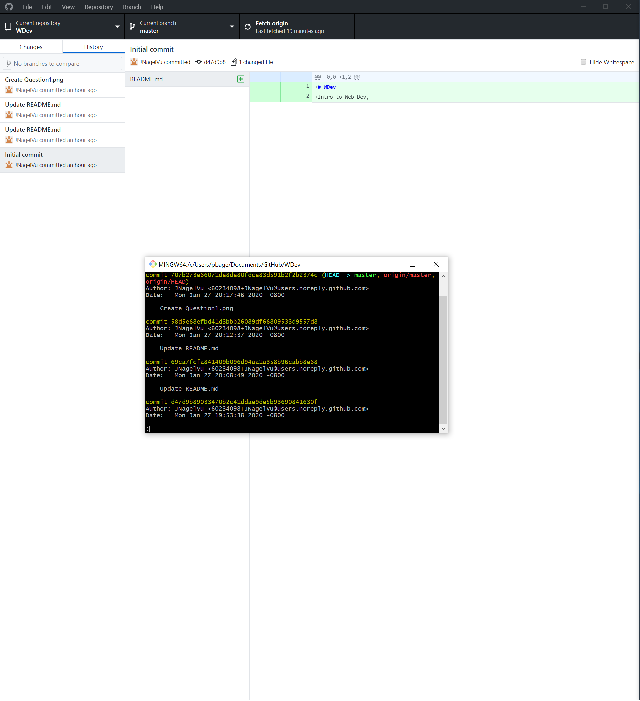

# Homework #2 Solution
**Student Name**: John Nagel
**NetID**: rf8489
# Question 1
## (a)

in the example html code in the assignment:
    nav is a tag and class="navbar navbar-expand-sm navbar-dark bg-dark sticky-top" is an attribute
    a is a tag and class="navbar-brand d-none d-md-block" href="#" are attributes
    img is a tag and alt="Grotto Networking" src="/images/sideLogo.png" style="width: 150px" are attributes
    close a 
    and close nav are closes to the tags
 

## (b)

No you can not use the same id on multiple elements, they must be unique.
The fact that we use them to link to the page does cause complication in linking
you can use the same class on multiple elemnts, but that means multiple elements would get styled, when you style one class 

## (c)

<!-- css example -->
body {
  padding-bottom: 50px;
}

#RelatedItems {
  max-height: 50vh;
  overflow-y: auto;
}

.graphDrawing {
  border: dashed thin #808080;
  border-radius: 5px;
  width: 90%;
  margin: 0;
  margin-bottom: 25px;
} 

The example's contains a CSS Element Seletctor for the Body, and a CSS class selector for .graphDrawing
    The Properties with respective value are Max-Height 50vh, overflow-y auto, border dashed, border-radius 5px,
    width 90%, margin 0, and margin-bottom, 25px

## (d)

    a.navbar-brand img  is the only CSS selector combinator used in the example. it combines the the class .navbar-brand with the 'a' tag or hyperlink group

# Question 2
## (a)

%Documents\GitHub\WDev\clubProject

# Question 3
## (a)

I'm creating a link to
<a href="https://github.com/JNagelVu/WDev/blob/master/Images/Question1.png">Quesiton 1 png</a>.

    
## (b)

I'm creating a link to
<a href="https://github.com/JNagelVu/WDev/blob/master/Images/question2.png">Quesiton 2 png</a>.

# Question 4
## (a)
<ol>
    <li>C++</li>
    <li>Java</li>
    <li>python</li>
</ol>
## (b)
<ul>
    <li>Windows 98-10</li>
    <li>Linux Redhat</li>
    <li>Mac</li>
</ul>
## (c)
<ul>
    <li>Visual Studios</li>
    <li>Cisco routing</li>
</ul>
# Question 5
## (a)
<pre>
    #include <iostream>
    #include <string>
    using namespace std;
    
    int main ()
    {
        string name;
        int x = 0;
        
        cout << "hello, what is your name? ";
        cin >> name;
        cout << "hello there " << name << " nice to meet you" << endl;
        cout << "good bye " << name;
        cin >> x;
        return 0;
        
    }
</pre>
## (b)

    CPP reference is a quick and easy to navigate webpage that lists most of the key functions that you can do in the language. To include but no limited to math functions located in cmath and the basic override functions
    <a href="https://en.cppreference.com/w/">CPP_Reference</a>

