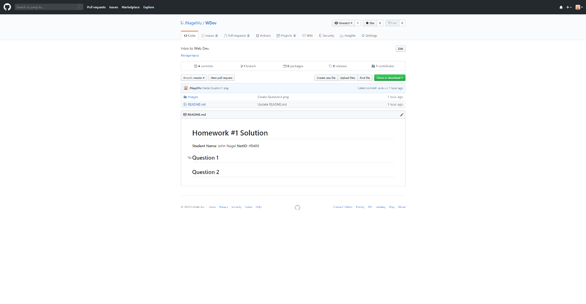

# Homework #1 Solution
**Student Name**: John Nagel
**NetID**: rf8489
# Question 1
# Question 2
# Question 3
## (a)

I'm creating a link to
<a href="https://github.com/JNagelVu/WDev/blob/master/Images/Question1.png">Quesiton 1 png</a>.

    
## (b)

I'm creating a link to
<a href="https://github.com/JNagelVu/WDev/blob/master/Images/question2.png">Quesiton 2 png</a>.

# Question 4
## (a)
<ol>
    <li>C++</li>
    <li>Java</li>
    <li>python</li>
</ol>
## (b)
<ul>
    <li>Windows 98-10</li>
    <li>Linux Redhat</li>
    <li>Mac</li>
</ul>
## (c)
<ul>
    <li>Visual Studios</li>
    <li>Cisco routing</li>
</ul>
# Question 5
## (a)
<pre>
    #include <iostream>
    #include <string>
    using namespace std;
    
    int main ()
    {
        string name;
        int x = 0;
        
        cout << "hello, what is your name? ";
        cin >> name;
        cout << "hello there " << name << " nice to meet you" << endl;
        cout << "good bye " << name;
        cin >> x;
        return 0;
        
    }
</pre>
## (b)

    CPP reference is a quick and easy to navigate webpage that lists most of the key functions that you can do in the language. To include but no limited to math functions located in cmath and the basic override functions
    <a href="https://en.cppreference.com/w/">CPP_Reference</a>

